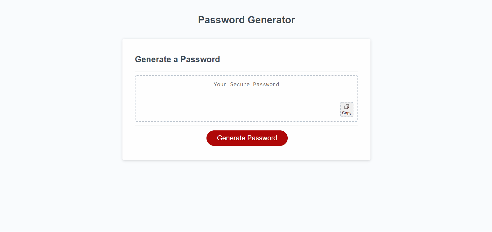

# Password Generator 🐱‍💻

HackerCat is pleased to present their super-secure password generator just like you like it

## Description

🔐 This repository contains the completed code for a password generator project requested by an anonymous client. This project began from a starter code file graciously provided by the UT Austin Full-Stack Coding Boot Camp. Our user story here is about an employee with access to lots of sensitive data, in need of a program to generate strong passwords in order to provide greater security.

🏗️ The provided starter code took care of the basic process of rendering whatever text I wanted to generate in my generatePassword() function, but that was about it. Aside from a couple variables, an undeclared function, an event listener, and a few query selectors there was nothing provided in the way of actually generating the password.

* To begin with, I began by creating the prompts that would collect the necessary user information, such as the length of the passsword and whether or not it would contain alpha-numeric and/or special characters.
* I knew from the start that I wanted to use an object to store all of this information, that way I would have an easier time referring back to it later.
* The next thing was to handle certain edge cases, like the user not selecting a proper number between 8 and 128 (or not a number at all), or not selecting any of the criteria. I solved these problems by using simple recursive while loops that validated the input and if it returned false, would recall the function that prompted them for the answer until they input the correct value.

🤕 After developing the prompts, I began the process of actually rendering the password, in which I ran into several headache-inducing problems. Namely, the problem of deciding whether to select random characters from several pre-set arrays and then shuffle their placement or to select characters randomly from a larger array made up of the pre-set choices. I decided to go with the latter, and in doing so ran into the problem of there not always being a character from the types specified. I then began implementing a system to check the password to ensure at least one character from the specified criteria was selected.

✋ NOTE: When discussing this issue with the TAs I was informed that creating this type of check was not in the scope of this project, and that as long as we were able to render random characters from an array made up of the user's selected choices we would be fine. I have to say, however, that **I couldn't disagree more**, as the simple chance of a user selecting (for instance) that they want all four criteria including special characters in an 8-character password, and not getting a special character **does not** satisfy the requirements of the project.

❓ The above considerations left me with a choice between using a pre-selected number of characters from the specified array (and a quicker, but less secure password system) or continuing on the path I began to forge and see the damn thing through. You can probably guess which option I chose.

🧵 To start with, an empty array was updated to contain all the characters from the user's specified criteria types. This began as a series of if statements that was later refactored into a for loop. An empty string is then updated with a random character from the larger array of character types to create the initial password. Then the check occurs.

✔️ I created a finalCheck() function that compares the fresh password against an array of the characters that should be included. If there are no characters from even one array of the user's choosing, the addCharacters() function that actually updates the string is re-run along with a message in the console alerting the user that the original password did not contain X characters.

👀 I understand that this type of check-system was outside the scope of the project, and I am glad to say that I consider the check-system to be vital to the success of this project as a simulation of real-world programming. There will always be a chance for shoddy code to make it through to production, but it's here that we should begin developing best practices for functional code that does what it says it should do. I'm excited to some day learn to implement actual tests for my projects.

🐱‍💻 And of course, I've always appreciated a little extra "umph", hence the impromptu copy button, the hackercat emoji, and the subsequent personality injected into the prompt statements.

## Table of Contents
- [Password Generator 🐱‍💻](#password-generator-)
  - [Description](#description)
  - [Table of Contents](#table-of-contents)
  - [Installation](#installation)
  - [Usage](#usage)
  - [Credits](#credits)
  - [License](#license)
  - [Features](#features)
  - [How to Contribute](#how-to-contribute)

## Installation
Locate the dropdown menu labeled 'Code' to the left of the About section in the main page of this repository. From there, select your preferred cloning method from HTTPS, SSH, or the GitHub CLI. For this demonstration, we will be using the SSH method. Copy the link and head to your terminal. From the command line you should enter:

    git clone <INSERT_SSH_KEY_HERE>

Replacing the above placeholder with the link copied from GitHub. This will clone the repository into a local directory on your machine. And that's it! Happy Hacking! 🚀

## Usage
This code is strictly for use as HackerCat intended 🐱‍💻 and is only provided as material for study and otherwise double-checking implementation of various basic javascript functionality. Screenshots of original mockup are included.

   

## Credits
UT Austin Coding Boot Camp https://techbootcamps.utexas.edu/coding/

Kyle Ferguson https://github.com/kferguson52

Stack Overflow https://stackoverflow.com/

W3 Schools https://www.w3schools.com/

MDN Web Docs https://developer.mozilla.org/en-US/

TA of House Puckwudgie (Floyd), the late night study group where we bashed this out as a team, and the rest of the UT Austin Coding Boot Camp cohort!

## License
MIT License

Copyright (c) 2021 Keenan R. Chiasson

Permission is hereby granted, free of charge, to any person obtaining a copy
of this software and associated documentation files (the "Software"), to deal
in the Software without restriction, including without limitation the rights
to use, copy, modify, merge, publish, distribute, sublicense, and/or sell
copies of the Software, and to permit persons to whom the Software is
furnished to do so, subject to the following conditions:

The above copyright notice and this permission notice shall be included in all
copies or substantial portions of the Software.

THE SOFTWARE IS PROVIDED "AS IS", WITHOUT WARRANTY OF ANY KIND, EXPRESS OR
IMPLIED, INCLUDING BUT NOT LIMITED TO THE WARRANTIES OF MERCHANTABILITY,
FITNESS FOR A PARTICULAR PURPOSE AND NONINFRINGEMENT. IN NO EVENT SHALL THE
AUTHORS OR COPYRIGHT HOLDERS BE LIABLE FOR ANY CLAIM, DAMAGES OR OTHER
LIABILITY, WHETHER IN AN ACTION OF CONTRACT, TORT OR OTHERWISE, ARISING FROM,
OUT OF OR IN CONNECTION WITH THE SOFTWARE OR THE USE OR OTHER DEALINGS IN THE
SOFTWARE.

## Features
- Click the button to generate a password
- Presents a series of prompts for password criteria
- Allows selection of password length
- Password length ranges between 8 and 128
- Passwords can include lowercase, uppercase, numeric, and/or special characters
- Input validation to ensure proper values and at least one character type is selected
- Generates a password that truly matches the selected criteria

## How to Contribute

See the [Contributor Covenant](https://www.contributor-covenant.org/) for details on how to contribute
